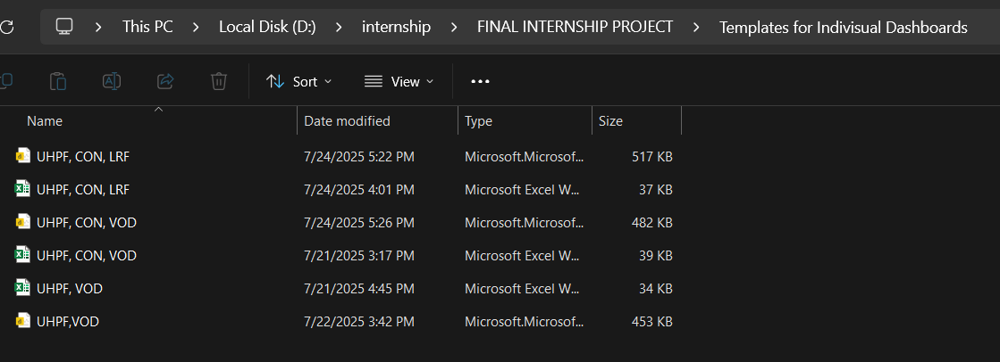
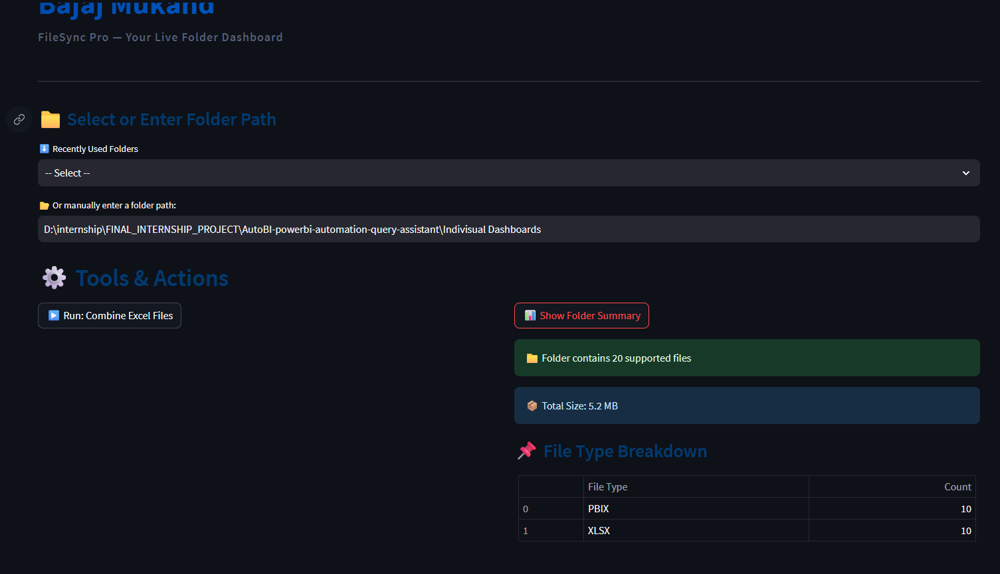
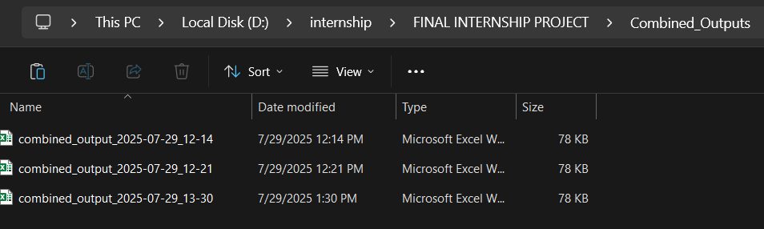

# 📊 PowerBI Automation and Query System — README

This guide explains how to generate **individual dashboards**, combine them, and run **natural language queries** on Excel data using the custom-built web app.

---

## 🔹 Step 1: Creating Individual Dashboards

### 1. Choose Templates
- Navigate to:  
  `Templates for Individual Dashboards`
- Based on the heat number and sections involved (e.g., `UHPF, CON, LRF`), open the appropriate template Excel and PowerBI files.

---

### 2. Save Copies as Heat Number
- Save both the Excel and PowerBI files using the **heat number** as the filename (e.g., `N6491`)  
- Save them into the `Individual Dashboards` folder

---

### 3. Link Excel to PowerBI
- Open the newly saved PowerBI file  
- Go to:

Transform Data > Data Source Settings > Data Sources in Current File > Change

- Link the PowerBI file to the corresponding Excel file saved above.

---

## 🔹 Step 2: Input Data from SAP

### 4. Paste SAP Data into Excel
Copy from the **main SAP Excel file** into the connected Excel workbook:

#### For `noyield` sheets:
- Heat No  
- Material  
- Actual Amount  
- Actual Quantity  
- Unit  
- Final Product Name  
- Price  
- Quantity

#### For `yield` sheets:
- Same as above, but exclude final product details.  
⚠️ Don't include materials like **lime, florspar powder** in `Actual Quantity`.

---

### 5. Refresh PowerBI Dashboard
- Save the Excel file  
- Return to PowerBI  
- Click **Refresh** to update the data

✅ Your **Individual Dashboard** is ready!

---

## ✅ Key Reminders
- Always save files in the `Indivisual Dashboards` folder
- Name files clearly using the heat number (`N6491`, etc.)

---

## 🔸 Step 3: Combined Dashboard (Web App)

### 6. Launch Web App
- Go to the `Final Web Application` folder  
- Run the `run_app.py` file

---

### 7. Web App Interface
- After running, the dashboard will load
- INPUT THE FILEPATH OF THE `Individual Dashboards` FOLDER.
- You’ll see options like:
- 🔘 `Run: Combine Excel Files`
- 🔘 `Folder Summary`

---

### 8. Combine Excel Files
- Click **Combine Excel Files**
- Select the `Individual Dashboards` folder
- Choose the `Combined_outputs` folder to save the result

---

### 9. If needed, Click Folder Report
- It will show you the folder summary, how many files are supported, types of files etc.

### 10. Now Open the Combined Output File
- Down in the application, you can find all combined files. 
  MAKE SURE THE NAME STARTS WITH `combined_output_...` (... part can contain your heat Numbers.)
- Then Go to:

Transform Data > Data Source Settings > Data Sources in Current File > Change
- choose the combined output file you want from the `Combined_outputs` folder.

- Apply Changes.

✅ Combined Dashboard is now ready

- To make multiple combined dashboards, simply Save As the `combined_output_...` to the name you want,
and change the new file's connected Excel File.
REMEMBER TO ALWAYS FOLLOW THE " MAKE SURE THE NAME STARTS WITH `combined_output_...`" WHEN SAVING AS.
---

## 🔸 Step 4: Query with Natural Language

### 10. Use Excel Query Chatbot
- In the web app’s query section, upload Excel files
- Enter queries like:
- `Heat - N6491, Material = Steel, Quantities > 10`
- `Heat - N6493, materials`
- `Heat - N6497, materials, section - UHPF`

---

## ✅ Final Notes

- Do **not delete** the combined output file  
- Ensure correct folders are selected for combining  
- Refresh the PowerBI file after every data change  
- Keep naming consistent

---

